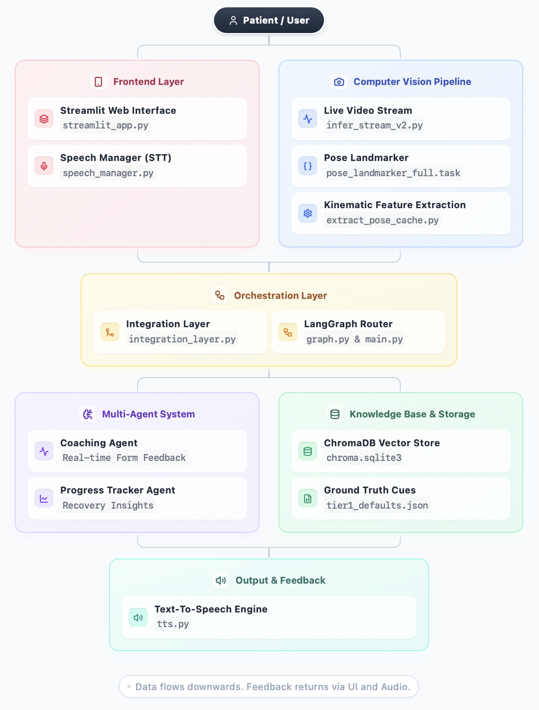
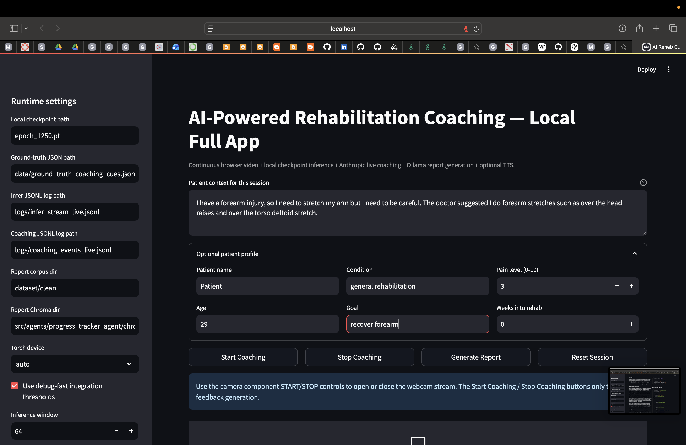
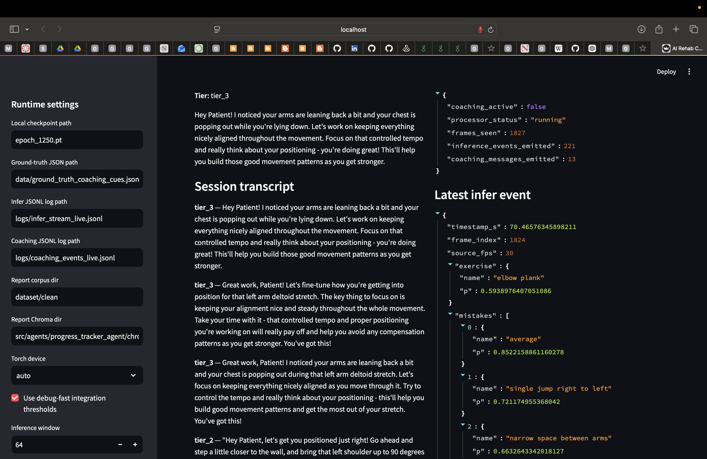
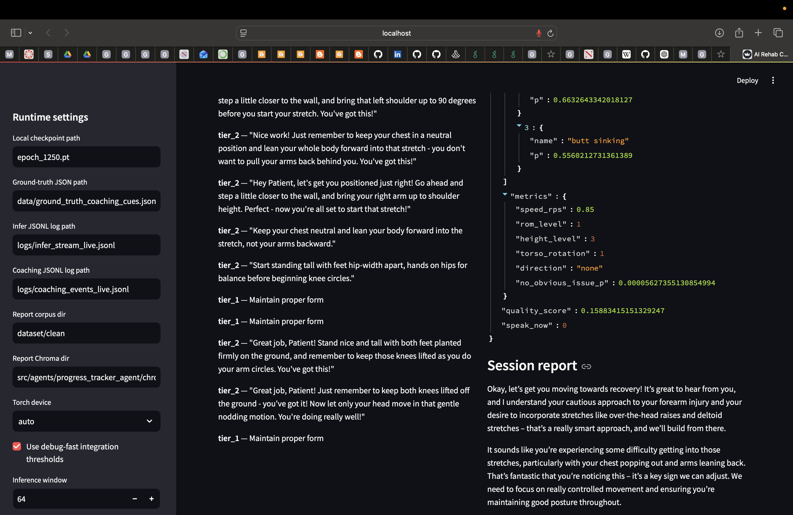
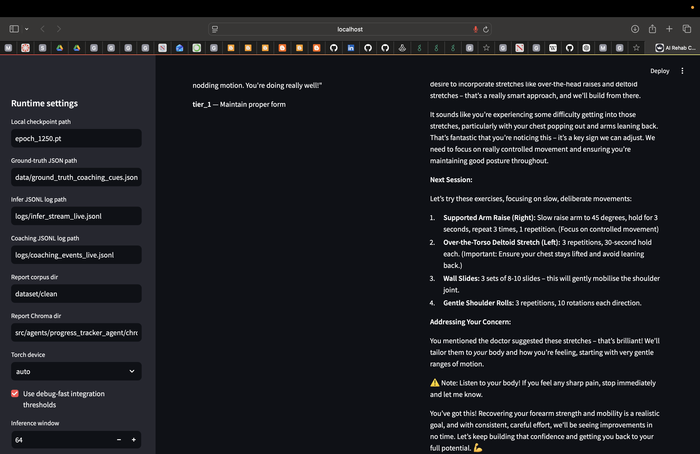

# AI Agent for Medical Rehabilitation Coaching

**Virtual Physical Therapy Assistant (VPA)** — a multimodal AI agent that watches you exercise, identifies form errors, and coaches you in real time, from your computer or phone.

Built by **Andre Barle, Jason Leung, David Ryan, and Rongjia Sun** as part of the Northeastern University DS 5500: Data Science Capstone (April 2026).

---

## The Problem

~70–76% of patients are non-compliant with home rehabilitation exercises. Once discharged from clinical care, patients lose access to the supervisory feedback loop that a physiotherapist provides — leading to compensatory movements, re-injury, and prolonged recovery. The core challenge is replicating that in-clinic feedback experience at home, on consumer hardware.

---

## Our Solution

The VPA combines three tightly integrated components:

| Component | Role |
|---|---|
| **Computer Vision Pipeline** | Classifies exercises and detects form mistakes using a fine-tuned MediaPipe + PoseTCN model |
| **Integration Layer** | Cleans raw CV output, aggregates predictions over time, and routes coachable events to the appropriate response tier |
| **RAG Pipeline + Multi-Agent System** | Constructs clinically grounded feedback via a RAG-enabled LLM; tracks longitudinal progress across sessions |

---

## Architecture



### Computer Vision Pipeline

- Overlays **Google MediaPipe** pose estimation over ~290k exercise video clips from the QEVD dataset
- Extracts **33 keypoints per frame** (x, y, z, visibility), normalized and centered to hips
- Each frame becomes a **198-dimensional feature vector**: position (66), velocity (66), depth (33), confidence (33)
- Pose sequences are stored as `.npz` files and processed to memory-mapped `.f16.mmap` format for fast training

**PoseTCNTyped Model** — a Temporal Convolutional Network with 8 multi-task output heads:
- 6 layers of 1D dilated causal convolutions (kernel=3, exponential dilation)
- Heads: exercise identity, mistake types, speed, range of motion, height, torso, direction, no-issue flag
- Optimizer: AdamW (lr=1e-4, weight decay=1e-4, gradient clipping=1.0)
- **~80% accuracy across 148 exercise classes**

### Integration Layer — The Intelligence Bridge

15 FPS × 60s = 900 raw predictions/minute. The integration layer filters this to actionable coaching events via a four-stage pipeline:

1. **Temporal Aggregation** — 10s sliding window, ≥30% persistence, ≥0.35 confidence, ≥3s duration
2. **Deduplication** — 10s cooldown; re-coaches at 20s if a mistake persists
3. **Severity Classification** — High / Medium / Low based on safety-critical keywords
4. **3-Tier Routing Decision** — routes to the appropriate response pipeline

Validated on **1,509 QEVD videos**: ~95% noise reduction, 27–32% video coverage (persistent error detection).

### 3-Tier Response System

| Tier | Trigger | Latency |
|---|---|---|
| **Tier 1** — Cache | Low-risk or known pattern | ~50ms |
| **Tier 2** — RAG + LLM | Novel errors requiring clinical grounding | ~2–5s |
| **Tier 3** — CoT Agent | Complex or high-risk mistakes | ~5–8s |

### RAG Module — Clinically Grounded Coaching

- **Knowledge base**: physiotherapy textbooks (Kisner & Colby, Houglum) + NHS MSK patient guides
- **1,486 chunks** indexed in ChromaDB with `sentence-transformers/all-MiniLM-L6-v2`
- Queries built dynamically from patient context (condition + rehab phase + concern); k=3 retrieval
- Clinical context injected with strict boundary constraints to reduce hallucination

### Multi-Agent System

**Coaching Agent** (Claude Sonnet 4.5):
- Ingests coaching events every 5s from the CV module via a session state machine
- 30s inactivity → exercise ends → exercise-level feedback generated (what went wrong, what was good, one correction cue)
- 120s inactivity → rehab phase ends → phase report generated + Phase JSON exported

**Progress Tracking Agent** (Gemma 3:4b, runs locally via Ollama):
- Reads cumulative Phase JSONs across sessions
- Analyzes pain trend, quality score trend, persistent mistakes, and exercise progression
- Generates a narrative longitudinal progress report

Phase JSON is the structured inter-agent memory: no database required.

### LLM Evaluation & Model Selection

3 models evaluated on 28 expert-authored physiotherapy questions across 8 metrics (fact coverage, semantic coverage, completeness, safety pass rate, professional referral rate, medical accuracy, latency, cost):

| Model | Overall | Fact Cov. | Sem Cov. | Completeness | Latency | Cost |
|---|---|---|---|---|---|---|
| **Claude Sonnet 4.5** | **58.93** | **41.5%** | **69.7%** | **46.9%** | 8.3s | $0.244 |
| Qwen2.5:7b | 54.18 | 31.4% | 53.1% | 35.7% | 13.5s | $0 |
| Gemma3:4b | 54.04 | 29.8% | 47.6% | 34.1% | 12.3s | $0 |

All 3 models achieved 100% safety pass rate, professional referral rate, and medical accuracy.

**Decision**: Claude Sonnet 4.5 selected for the Coaching Agent. Gemma 3:4b selected for the Progress Tracking Agent (runs locally, zero API cost).

---

## Demo

### Session Setup & Patient Profile



### Live Coaching Transcript



### Inference Events & Session Log



### Session Report



---

## Environment Setup

### Prerequisites

- **Conda** (Miniconda or Anaconda)
- **Python 3.11**
- **Ollama** (for local Gemma 3:4b inference)
- An **Anthropic API key** (for Claude Sonnet 4.5)

### Installation

```bash
git clone https://github.com/DS5500-Team-11-AI-Powered-Rehab/AI-Powered-Rehabilitation-Coaching-System.git
cd AI-Powered-Rehabilitation-Coaching-System

conda env create -f rehab_ai_env.yml
conda activate rehab_ai_env
```

Copy `.env.example` to `.env` and add your API keys:

```bash
cp .env.example .env
```

### Running the App

```bash
# Ingest the PT knowledge base into ChromaDB
python scripts/ingest_pt_data.py

# Pre-compute Tier 1 cache responses
python scripts/build_tier1_cache.py

# Launch the Streamlit frontend
streamlit run frontend/streamlit_app.py
```

---

## Project Structure

```
AI-Powered-Rehabilitation-Coaching-System/
│
├── README.md
├── rehab_ai_env.yml                 # Conda environment specification
├── .env.example                     # API key template (copy to .env)
├── .gitignore
├── pytest.ini
├── LICENSE
│
├── cache/                           # Tier 1 cached responses
│
├── data/                            # Input data directory
│
├── logs/                            # Session logs & debug output
│
├── models/                          # Trained CV model checkpoints
│
├── results/                         # Experiment results & metrics
│
├── figures/                         # Project visualizations
│
├── images/                          # Architecture diagram & demo screenshots
│   ├── architecture_diagram.png
│   ├── demo1.png
│   ├── demo2.png
│   ├── demo3.png
│   └── demo4.png
│
├── src/                             # Production code
│   ├── __init__.py
│   │
│   ├── cv/                          # Computer Vision Pipeline
│   │   ├── models/                  # Model checkpoints
│   │   ├── extract_pose_cache.py    # Extract pose data from videos
│   │   ├── infer_stream_v2.py       # Real-time webcam inference (15 FPS)
│   │   ├── precompute_memmap.py     # Convert pose to memory-mapped format
│   │   └── train_from_memmap.py     # PoseTCNTyped training script
│   │
│   ├── integration/                 # Integration Layer (CV → LLM Bridge)
│   │   ├── __init__.py
│   │   ├── README.md
│   │   ├── integration_layer.py     # Temporal aggregation & routing
│   │   ├── graph.py                 # LangGraph workflow definition
│   │   ├── state.py                 # State schema & management
│   │   ├── ground_truth_library.py  # Ground truth definitions
│   │   └── main.py                  # Integration entry point
│   │
│   ├── agents/                      # Multi-Agent System (LangGraph)
│   │   ├── coaching_agent/          # Real-Time Coaching Feedback
│   │   │   ├── chroma_coaching_db/  # Coaching RAG vector store
│   │   │   ├── README.md
│   │   │   ├── coaching_agent.py
│   │   │   ├── session_manager.py   # Session state machine
│   │   │   ├── session_prompts.py   # Prompt templates
│   │   │   ├── demo_session.py
│   │   │   └── demo_session.ipynb
│   │   │
│   │   └── progress_tracker_agent/  # Longitudinal Progress Tracking
